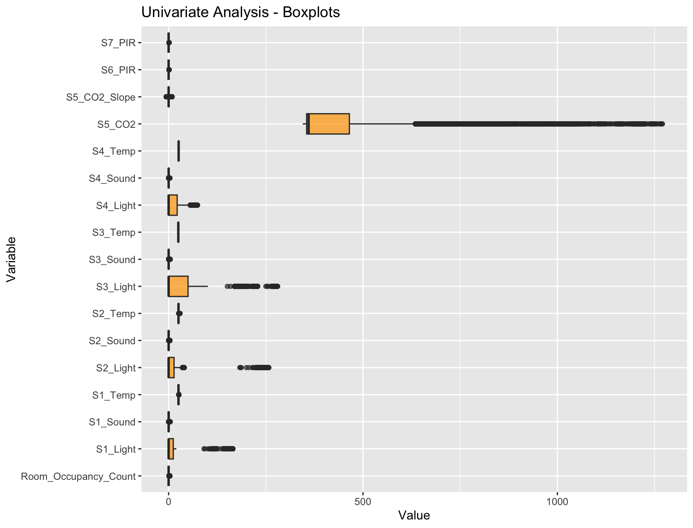
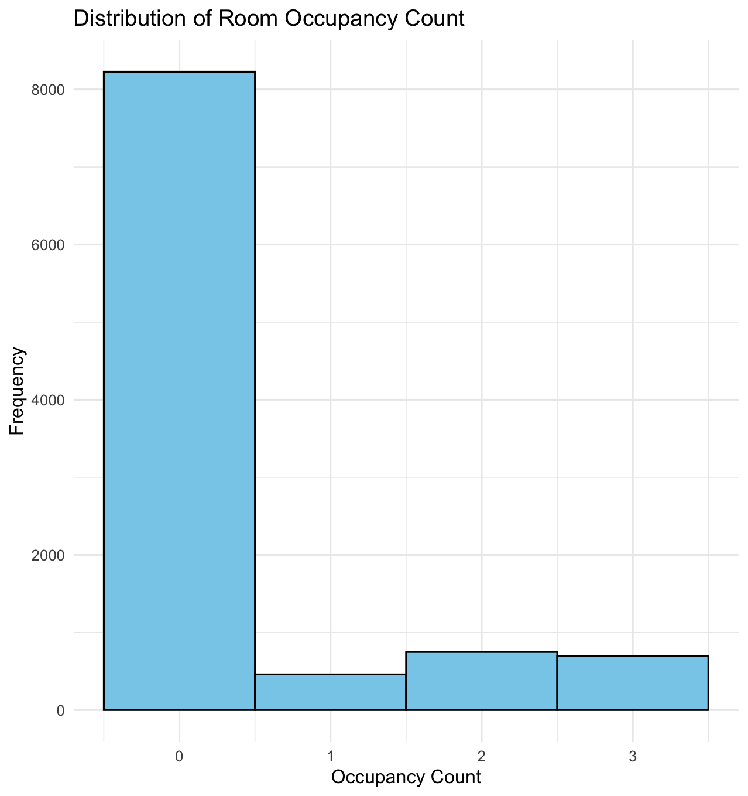
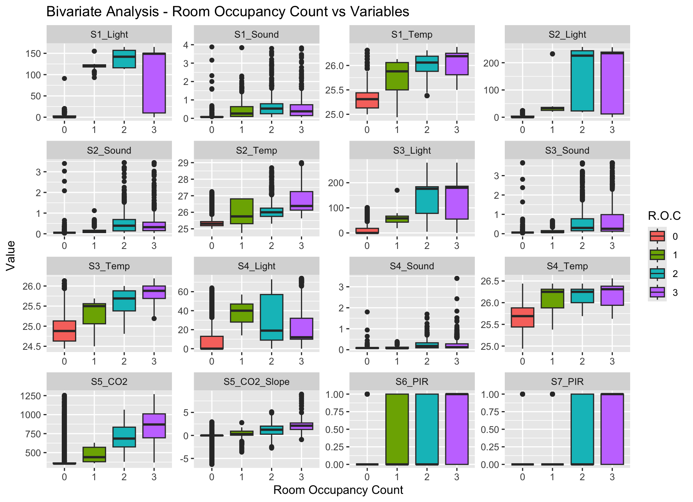
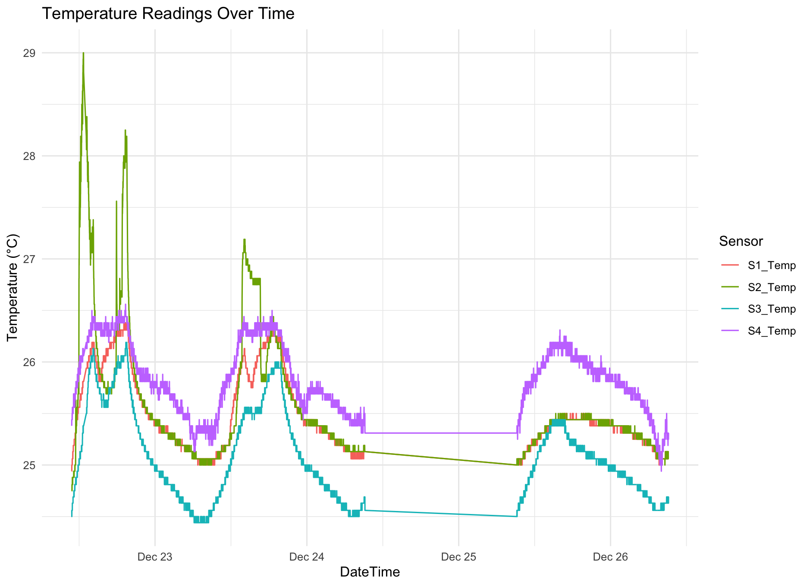

# Data Description

## I. Overview of the Dataset

The dataset analyzed here is sourced from the UCI Machine Learning Repository and provides detailed sensor data for room occupancy estimation. The data was collected in a controlled environment over several days to develop a model that estimates the number of people in a room based on sensor readings. The dataset contains 10,129 entries, with each row representing a unique timestamped set of sensor readings. The entries include measurements from temperature, light, sound, CO₂, and PIR motion sensors, along with the manually recorded room occupancy count ranging from 0 to 3 persons.

Experiments were conducted in a 6m x 4.6m room without HVAC systems to eliminate confounding factors from artificial air circulation. The occupancy was varied between 0 and 3 people, and ground truth was ensured by manually recording the number of occupants.

## II. Variable Information (Codebook)

The table below outlines key variables included in the dataset:

| Variable Name            | Variable Label                                            | Valid Range / Codes                                   |
|--------------------------|-----------------------------------------------------------|-------------------------------------------------------|
| **S1_Temp**              | Temperature reading from Sensor 1 (Node S1)               | Float (Min: 24.94, Max: 26.38)                        |
| **S2_Temp**              | Temperature reading from Sensor 2 (Node S2)               | Float (Min: 24.75, Max: 29.00)                        |
| **S3_Temp**              | Temperature reading from Sensor 3 (Node S3)               | Float (Min: 24.44, Max: 26.19)                        |
| **S4_Temp**              | Temperature reading from Sensor 4 (Node S4)               | Float (Min: 24.94, Max: 26.56)                        |
| **S1_Light**             | Light intensity reading from Sensor 1 (Node S1)           | Integer (Min: 0, Max: 165)                            |
| **S2_Light**             | Light intensity reading from Sensor 2 (Node S2)           | Integer (Min: 0, Max: 258)                            |
| **S3_Light**             | Light intensity reading from Sensor 3 (Node S3)           | Integer (Min: 0, Max: 280)                            |
| **S4_Light**             | Light intensity reading from Sensor 4 (Node S4)           | Integer (Min: 0, Max: 74)                             |
| **S1_Sound**             | Sound level reading from Sensor 1 (Node S1)               | Float (Min: 0.06, Max: 3.88)                          |
| **S2_Sound**             | Sound level reading from Sensor 2 (Node S2)               | Float (Min: 0.04, Max: 3.44)                          |
| **S3_Sound**             | Sound level reading from Sensor 3 (Node S3)               | Float (Min: 0.04, Max: 3.67)                          |
| **S4_Sound**             | Sound level reading from Sensor 4 (Node S4)               | Float (Min: 0.05, Max: 3.40)                          |
| **S5_CO2**               | CO₂ concentration reading from Sensor 5 (Node S5)         | Integer (Min: 345, Max: 1270)                         |
| **S5_CO2_Slope**         | Rate of change of CO₂ concentration from Sensor 5         | Float (Min: -6.29615, Max: 8.98077)                   |
| **S6_PIR**               | PIR motion detection from Sensor 6 (Node S6)              | Binary (0: No motion, 1: Motion detected)             |
| **S7_PIR**               | PIR motion detection from Sensor 7 (Node S7)              | Binary (0: No motion, 1: Motion detected)             |
| **Room_Occupancy_Count** | Manually recorded number of people in the room            | Integer (Min: 0, Max: 3)                              |
| **DateTime**             | Combined date and time of the sensor readings             | DateTime (e.g., "2017-12-22 10:49:41")                |

## III. Source of Data

The dataset is sourced from the UCI Machine Learning Repository and is titled "Room Occupancy Estimation." The data was collected through controlled experiments aimed at estimating room occupancy based on sensor data. Sensors used include temperature, light, sound, CO₂ concentration, and PIR motion detectors.
- [Link to data](https://archive.ics.uci.edu/dataset/864/room+occupancy+estimation)

## IV. Exploratory Data Analysis

<table>
  <tr>
    <td style="text-align: center;">
      
    </td>
    <td style="text-align: center;">
      
    </td>
  </tr>
  <tr>
    <td style="text-align: center;">
      
    </td>
    <td style="text-align: center;">
      
    </td>
  </tr>
</table>

### Key Insights

#### 1. Sensor Effectiveness for Occupancy Detection

- **CO₂ Concentration**: Strongest correlation with occupancy levels, showing a clear increase with more people in the room. This makes CO₂ an essential feature for occupancy estimation.
- **Light Intensity**: Clearly distinguishes between occupied and unoccupied states. The variability at higher occupancy levels indicates different usage patterns of lighting (e.g., room configurations, daylight).
- **Sound Levels**: Show a positive correlation with occupancy. The noise increases steadily with more occupants, making it a good predictor.
- **PIR Motion Sensors**: Effectively detect presence (0 vs. non-zero occupancy) but lack granularity to distinguish between levels of occupancy (e.g., 1 vs. 3).
- **Temperature Sensors**: Provide limited but consistent information, with minor increases in temperature linked to higher occupancy.

#### 2. Room Dynamics and Environmental Factors

- **Diurnal Patterns**: Temperature readings and light intensity exhibit diurnal variation (peaks during the day and drops at night), reflecting natural environmental conditions in the absence of HVAC systems.
- **Sensor Synchronization**: All sensors show consistent trends over time, indicating reliability in data collection and minimal technical anomalies.

#### 3. Occupancy Distribution

- **Class Imbalance**: The data is heavily skewed towards 0 occupancy (most time periods have no occupants), which could bias models. Higher occupancy levels (1, 2, 3) are underrepresented, requiring balancing techniques to ensure predictive accuracy.
- **Low Variability for Zero Occupancy**: Environmental readings for 0 occupancy are stable, while variability increases with more occupants, indicating dynamic environmental changes in occupied states.

#### 4. Feature Importance for Occupancy Prediction

- **High Signal Features**: CO₂ levels, light intensity, and sound levels are the most informative features for predicting room occupancy.
- **Supplementary Features**: PIR sensors and temperature provide additional signals but are not as strong in distinguishing between specific levels of occupancy.

#### 5. Data Challenges and Limitations

- **Data Skewness**: The imbalance in occupancy distribution may result in poor model generalization for less frequent classes (1, 2, 3).
- **Context Sensitivity**: Features like sound and light might depend on specific room usage scenarios (e.g., quiet study vs. active discussions), potentially affecting model transferability across different environments.
- **Sensor Overlap**: Some sensors (e.g., multiple temperature and light sensors) might provide redundant information. Dimensionality reduction or feature selection may be needed for efficiency.

#### 6. Practical Implications

- **Model Focus**: Occupancy detection models should focus on a combination of CO₂, sound, and light data to maximize accuracy.
- **Addressing Class Imbalance**: Strategies like resampling (e.g., SMOTE) or weighted loss functions should be used to address class imbalance during training.
- **Real-Time Systems**: Real-time systems might benefit from prioritizing high-signal features to reduce computational overhead while maintaining performance.

## V. Data Preprocessing

The following preprocessing steps were performed:

1. **Combined Date and Time Columns**:
   - The original `Date` and `Time` columns were combined into a single `DateTime` column using the `as.POSIXct` function to facilitate time-series analysis.

2. **Removed Redundant Columns**:
   - After combining, the original `Date` and `Time` columns were removed from the dataset to avoid redundancy, using the `select` function.

3. **Checked for Missing Values**:
   - A check for missing values was performed across all columns using `colSums(is.na(occupancy))`, and no missing values were found in the dataset.

4. **Data Inspection**:
   - The structure of the dataset was inspected using `str(occupancy)` to confirm data types and ensure correct formatting of each variable.

5. **Data Dimensions**:
   - The dataset contains 10,129 rows and 19 columns, verified using `dim(occupancy)`.

