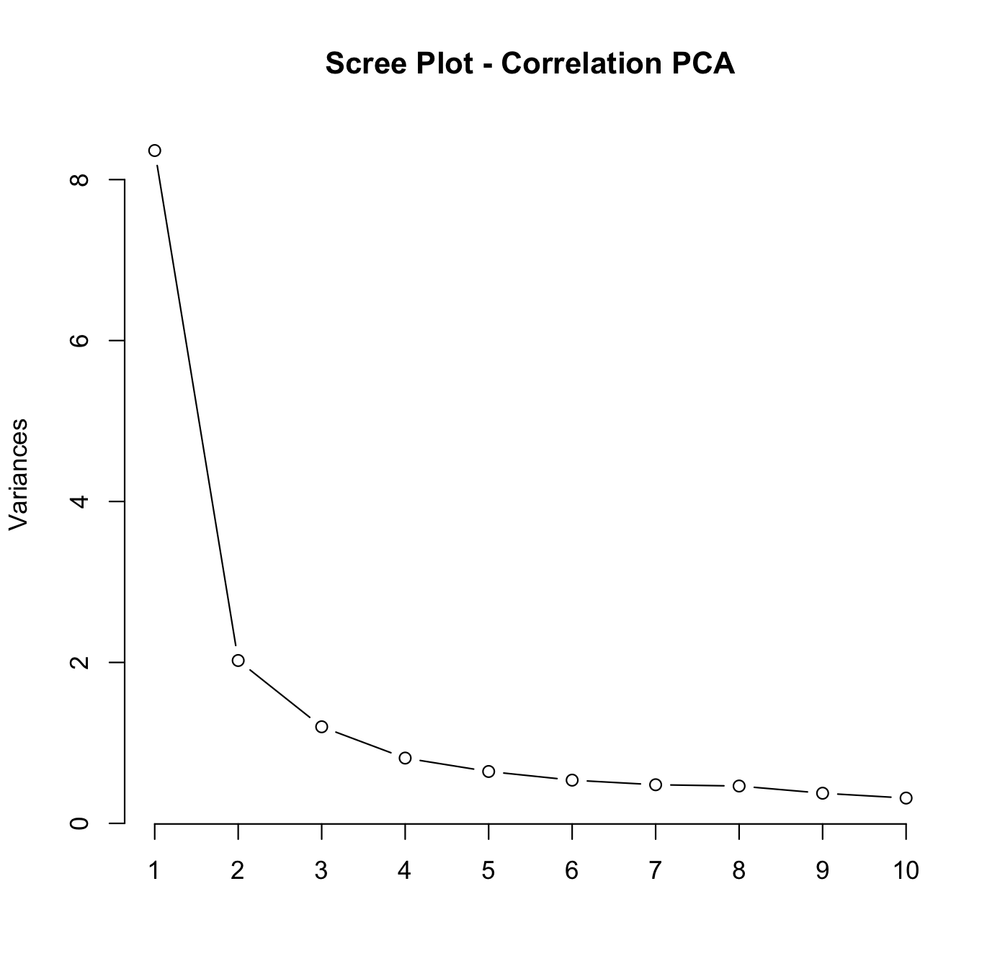
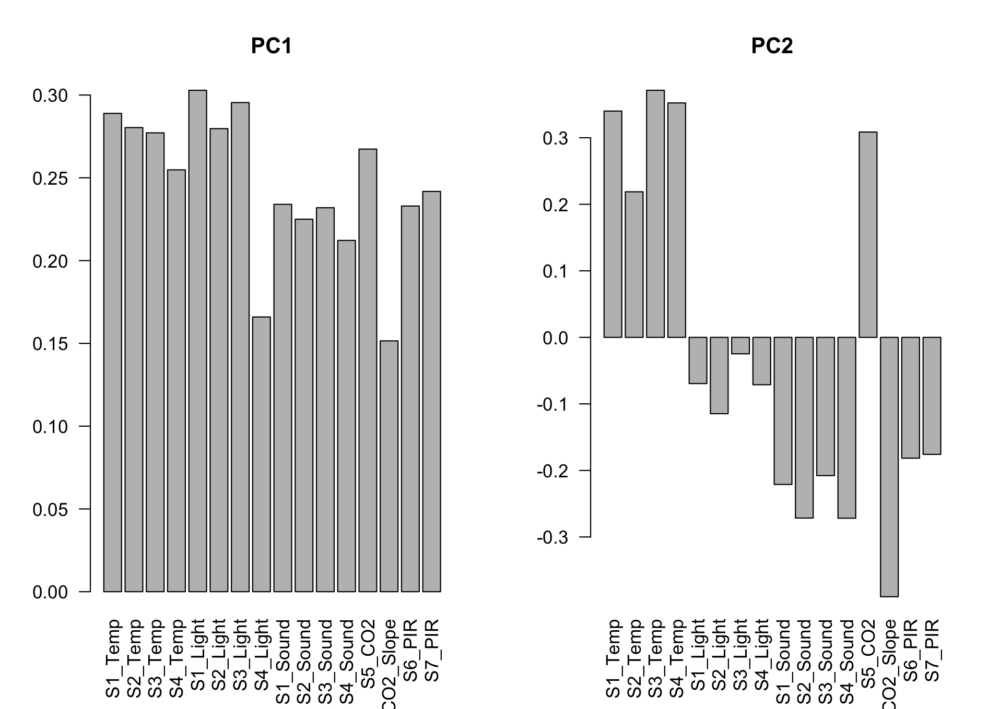
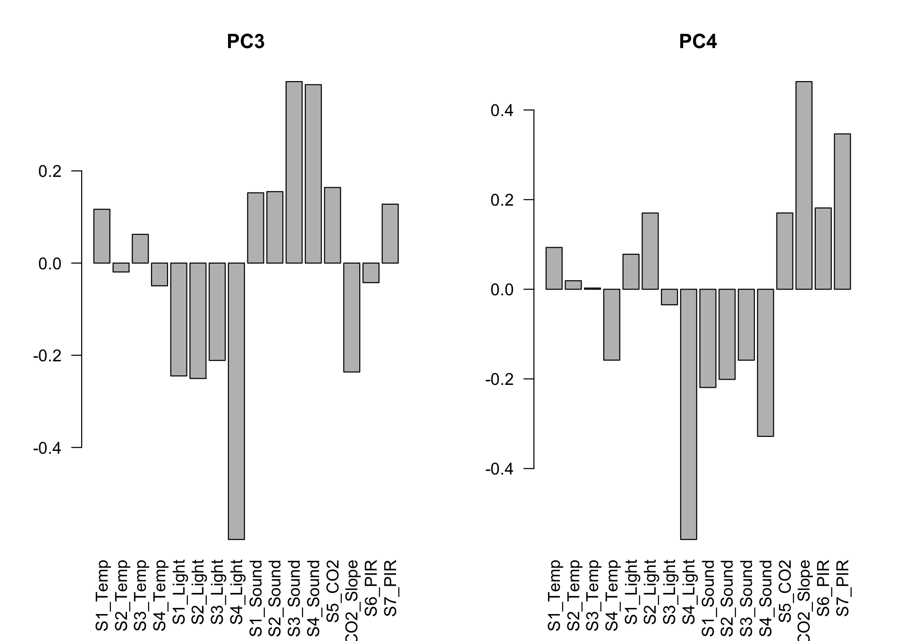
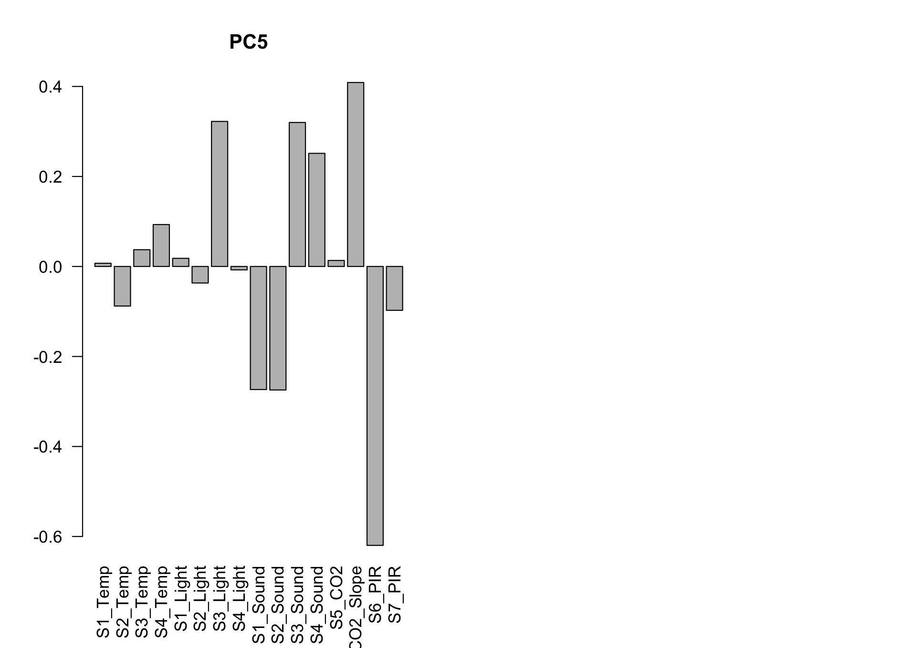
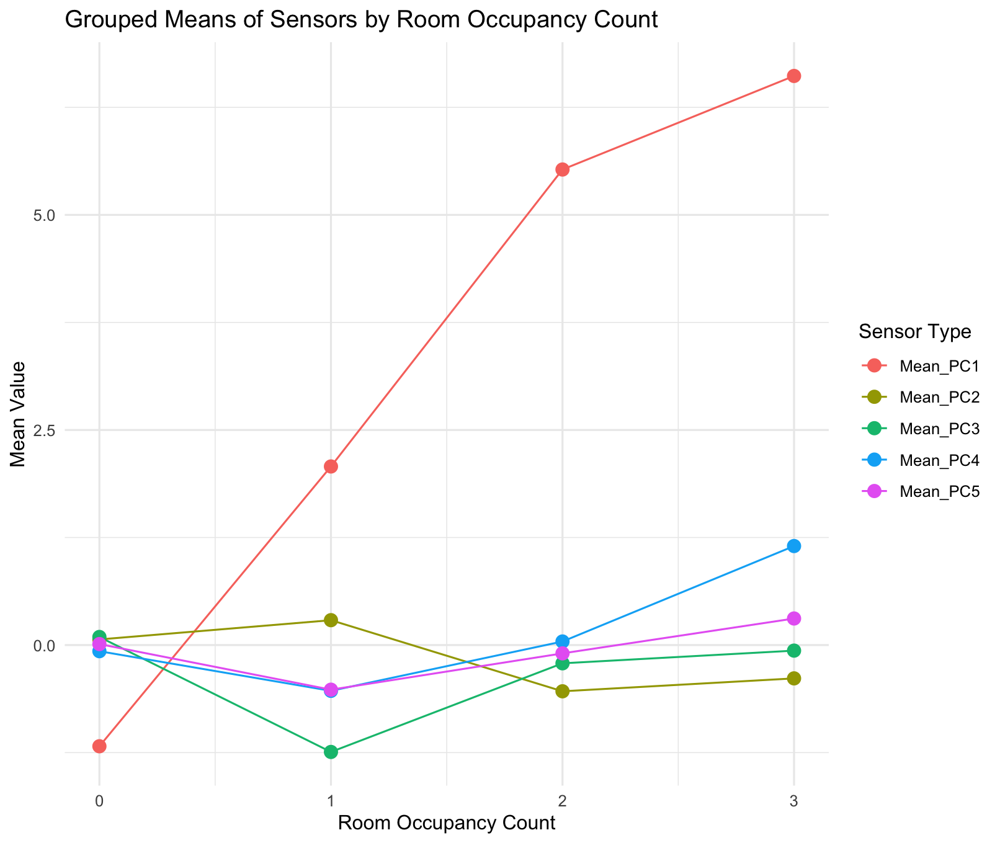
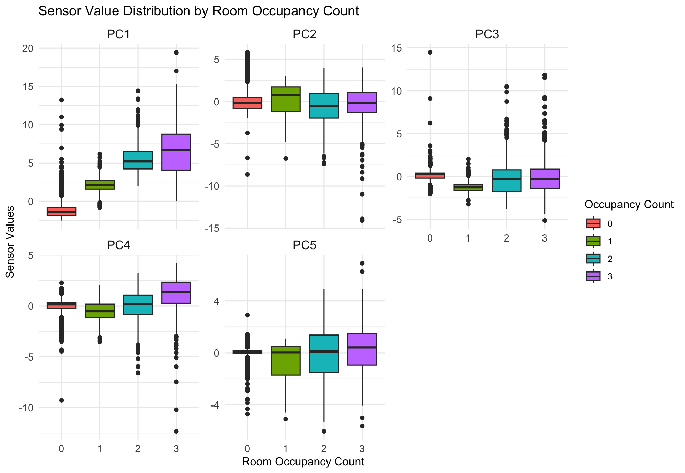
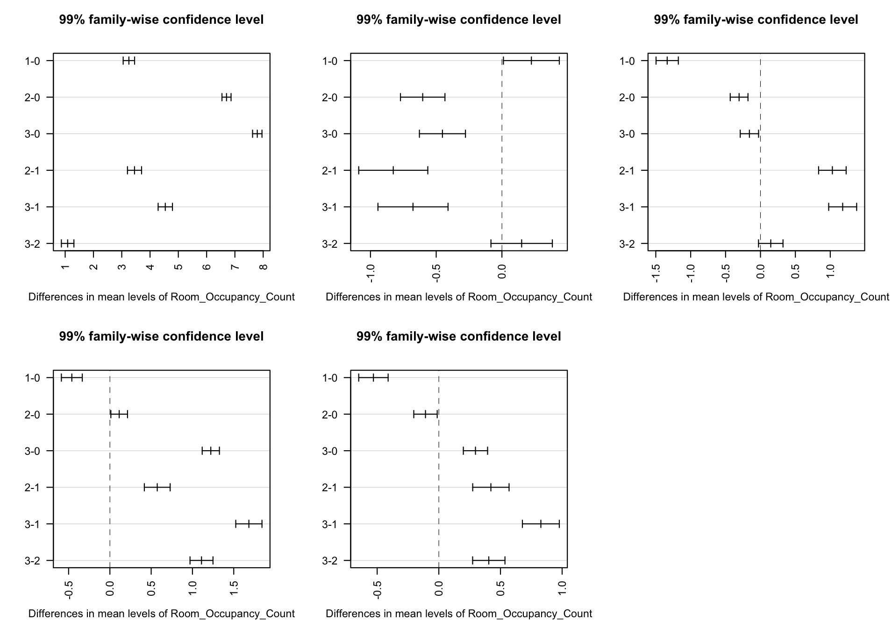
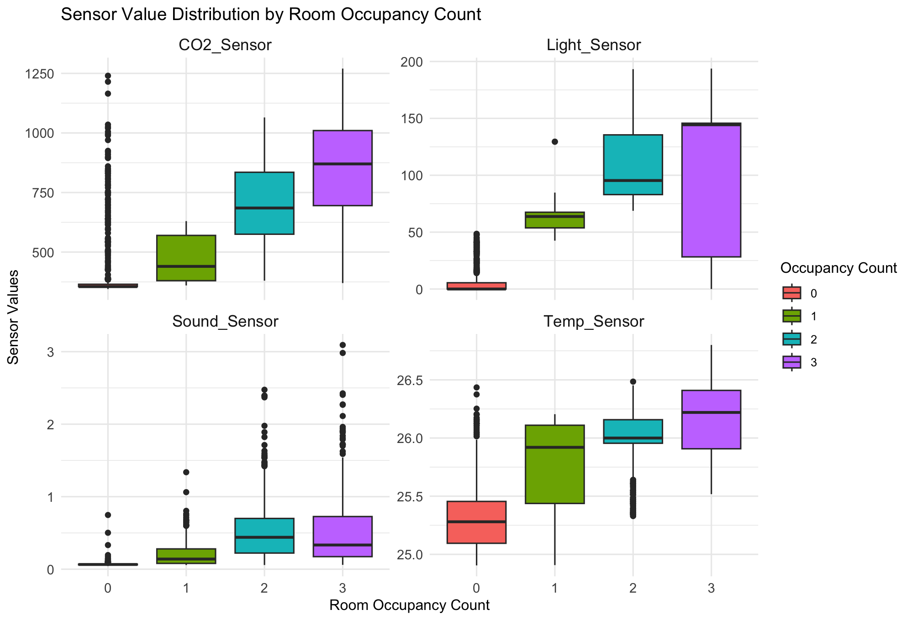
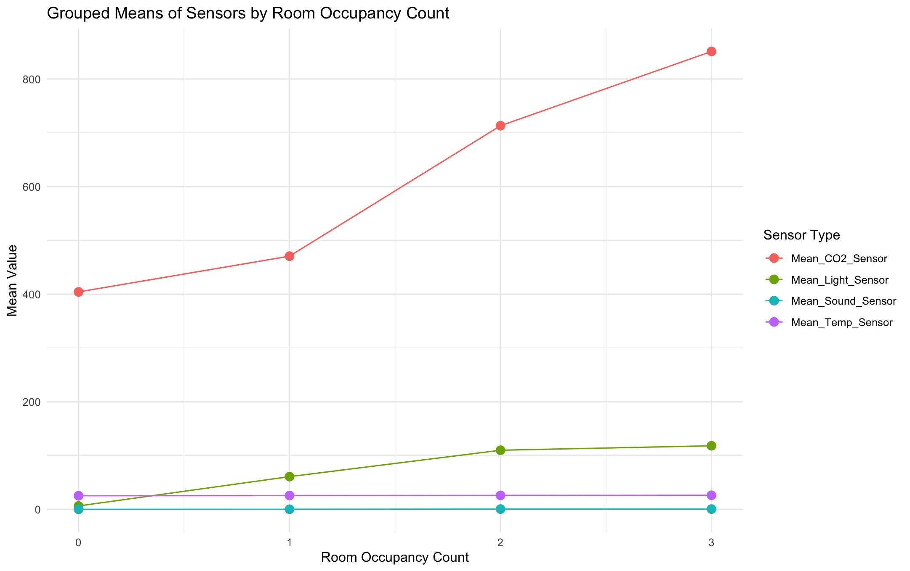
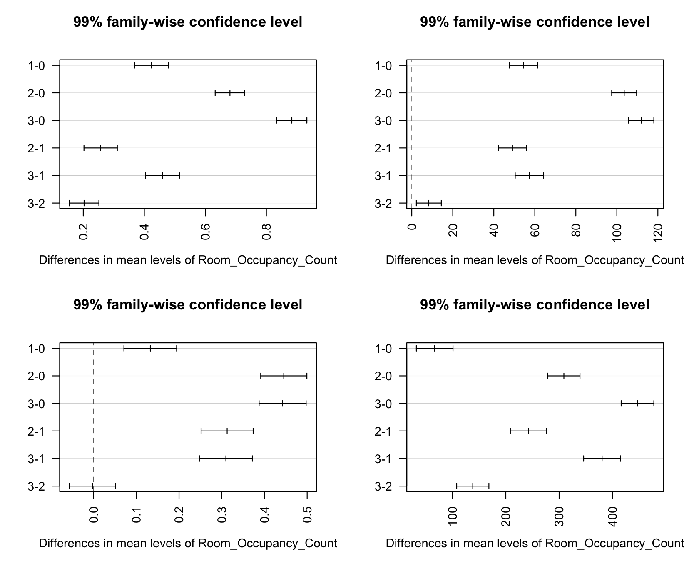

# First Approach: PCA and MANOVA

## Principal Component Analysis (PCA)

### Scree Plot

<table>
  <tr>
    <td style="text-align: center;">
      
    </td>
  </tr>
</table>

In the scree plot above, an elbow is observed between the third and fourth principal components (PCs). Despite the elbow suggesting three components, five principal components were retained for the analysis to capture a substantial portion of the total variance in the data. Retaining more PCs ensures that essential information is not lost, which could be critical for accurately estimating room occupancy.

### Interpretation of Principal Components

<table>
  <tr>
    <td style="text-align: center;">
      
    </td>
    <td style="text-align: center;">
      
    </td>
  </tr>
  <tr>
    <td style="text-align: center;">
      
    </td>
  </tr>
</table>

#### **PC1: Combined Environmental Activity**

- **High Positive Loadings:** Temperature, light, and CO₂ sensors.
- **Interpretation:** PC1 represents overall environmental activity influenced by room occupancy. Higher values indicate increased temperature, light intensity, and CO₂ levels, typically associated with more occupants in the room.

#### **PC2: Temperature and CO₂ Dynamics**

- **Positive Loadings:** Temperature and CO₂ sensors.
- **Strong Negative Loading:** CO₂ slope.
- **Interpretation:** PC2 captures the relationship between temperature and CO₂ concentration changes. The negative loading of CO₂ slope suggests this component differentiates between stable and rapidly changing CO₂ levels, reflecting varying occupancy patterns, such as people entering or leaving the room.

#### **PC3: Acoustic vs. Light Dynamics**

- **High Positive Loadings:** Sound sensors.
- **High Negative Loadings:** Light sensors.
- **Interpretation:** PC3 represents a contrast between noise levels and lighting conditions. It may indicate scenarios where a room is dimly lit but has significant sound activity (e.g., discussions in a room with subdued lighting) or brightly lit with minimal sound.

#### **PC4: Light and CO₂ Slope Interaction**

- **High Negative Loadings:** Light sensors.
- **High Positive Loadings:** CO₂ slope.
- **Interpretation:** PC4 reflects the interaction between decreasing light intensity and changes in CO₂ concentration. This component could represent transitional periods, such as occupants leaving the room (lights turning off) while CO₂ levels are still adjusting.

#### **PC5: Motion Sensor Activity**

- **High Negative Loadings:** PIR (Passive Infrared) sensors.
- **Interpretation:** PC5 isolates variations in motion detection, directly signaling occupancy through movement within the room.

## Multivariate Analysis of Variance (MANOVA)

### Grouped Means of Principal Components by Occupancy Count

<table>
  <tr>
    <td style="text-align: center;">
      
    </td>
    <td style="text-align: center;">
      
    </td>
  </tr>
</table>

- **PC1:** Mean values increase with higher occupancy levels, indicating a strong positive association with the number of occupants.
- **PC2 to PC5:** These components show varying means across occupancy levels but lack a consistent pattern like PC1.

### Statistical Tests

Two test statistics were used to assess the significance of differences across occupancy levels:

#### **Wald-Type Statistic (WTS)**

- **Test Statistic:** 48,617.838
- **Degrees of Freedom (df):** 15
- **p-value:** < 0.001

#### **Modified ANOVA-Type Statistic (MATS)**

- **Test Statistic:** 20,125.06
- **p-value:** < 0.001 (obtained via resampling)

### Interpretation

- **Significance:** Both WTS and MATS p-values are less than 0.001, indicating highly significant differences in the principal components across occupancy levels.
- **Conclusion:** The null hypothesis (that mean vectors of the PCs are equal across occupancy levels) is rejected.

### Post-Hoc Analysis: Pairwise Comparisons

The plots display 99% confidence intervals for the differences in mean values of PCs between occupancy levels.

#### **PC1: Overall Environmental Activity**

- **Significant Differences:** All pairwise comparisons show significant differences (confidence intervals do not include zero).
- **Notable Observation:** The confidence interval for the comparison between occupancy levels 3 and 2 is close to zero, indicating similar means.
- **Interpretation:** PC1 effectively differentiates between occupancy levels, especially between unoccupied and occupied rooms.

#### **PC2: Temperature and CO₂ Dynamics**

- **Significant Differences:** Significant when comparing unoccupied (0) to occupied levels (1, 2, 3).
- **Less Sensitivity:** Comparisons between higher occupancy levels (e.g., 3 vs. 2) are not significant.
- **Interpretation:** PC2 is useful for distinguishing unoccupied rooms but less effective for differentiating between occupied levels.

#### **PC3: Acoustic vs. Light Dynamics**

- **Significant Differences:** Notable between unoccupied (0) and low occupancy (1, 2).
- **Observations:** Confidence intervals for comparisons involving occupancy level 0 are negative, while those among occupied levels are positive.
- **Interpretation:** PC3 highlights contrasts in sound and light that are more evident when moving from no occupancy to some occupancy.

#### **PC4: Light and CO₂ Slope Interaction**

- **Significant Differences:** Observed mainly between unoccupied and occupied levels.
- **Less Pronounced Differences:** Between certain occupancy levels like 2 and 0.
- **Interpretation:** PC4 captures transitional environmental changes, useful for detecting the shift from unoccupied to occupied states.

#### **PC5: Motion Sensor Activity**

- **Significant Differences:** Across most occupancy comparisons, especially involving unoccupied rooms.
- **Less Effective:** Differentiating between higher occupancy levels.
- **Interpretation:** PC5 is effective for occupancy detection based on motion but struggles to quantify the number of occupants.

### General Insights

- **Strengths:** The PCA approach, coupled with MANOVA, confirms that sensor data encapsulated in the PCs varies significantly with occupancy levels.
- **Limitations:** Difficulty in differentiating between higher occupancy levels (e.g., 2 vs. 3 occupants) due to less pronounced differences in PCs beyond PC1.
- **Practical Implications:** While PCs can distinguish between unoccupied and occupied rooms, they are less effective for precise occupancy counting.

---

# Second Approach: Aggregated Sensor Data and MANOVA

## Data Aggregation

Sensor readings were averaged by type to simplify the dataset:

- **Temp_Sensor:** Mean of all temperature sensors.
- **Light_Sensor:** Mean of all light sensors.
- **Sound_Sensor:** Mean of all sound sensors.
- **CO₂_Sensor:** Single CO₂ sensor value (no averaging needed).

To address class imbalance, the data for the majority class (occupancy level 0) was undersampled to match the sample sizes of other occupancy levels.

## Multivariate Analysis of Variance (MANOVA)

### Grouped Means of Sensors by Occupancy Count

<table>
  <tr>
    <td style="text-align: center;">
      
    </td>
    <td style="text-align: center;">
      
    </td>
  </tr>
</table>

#### **Interpretation**

- **Temperature:** Increases progressively with more occupants, likely due to body heat.
- **Light Intensity:** Significantly higher when rooms are occupied, reflecting increased use of lighting.
- **Sound Levels:** Rise with occupancy, indicating more noise from occupant activities.
- **CO₂ Concentration:** Substantially higher with more occupants, as human respiration adds CO₂ to the environment.

### Statistical Tests

#### **Wald-Type Statistic (WTS)**

- **Test Statistic:** 19,756.258
- **Degrees of Freedom (df):** 12
- **p-value:** < 0.001

#### **Modified ANOVA-Type Statistic (MATS)**

- **Test Statistic:** 21,073.75
- **p-value:** < 0.001 (from resampling)

### Interpretation

- **Significance:** Extremely low p-values indicate significant differences in sensor readings across occupancy levels.
- **Conclusion:** The null hypothesis is rejected, affirming that occupancy levels affect sensor measurements.

### Post-Hoc Analysis: Pairwise Comparisons

Each plot shows the 99% confidence intervals for differences in mean sensor values between occupancy levels.

#### **1. Temperature Sensor**

- **Significant Differences:** Observed in all pairwise comparisons.
- **Interpretation:** Temperature reliably differentiates between occupancy levels due to heat generated by occupants.

#### **2. Light Sensor**

- **Significant Differences:** All comparisons show significant differences without confidence intervals crossing zero.
- **Interpretation:** Light intensity is highly sensitive to occupancy changes, reflecting increased lighting usage when rooms are occupied.

#### **3. Sound Sensor**

- **Significant Differences:** Notable between unoccupied (0) and occupied levels.
- **Less Sensitivity:** Between higher occupancy levels (2 vs. 3), confidence intervals approach zero.
- **Interpretation:** Sound levels distinguish unoccupied from occupied rooms but are less effective for quantifying occupants beyond the initial occupancy.

#### **4. CO₂ Sensor**

- **Significant Differences:** All pairwise comparisons are significant, with confidence intervals far from zero.
- **Interpretation:** CO₂ concentration is a robust indicator of occupancy, increasing steadily with more occupants due to respiration.

### General Summary

- **Overall Findings:** Aggregated sensor data effectively differentiates between occupancy levels.
- **Sensor Effectiveness:**
  - **CO₂ and Light Sensors:** Most sensitive to changes in occupancy across all levels.
  - **Temperature Sensor:** Reliable indicator but with less pronounced differences at higher occupancy.
  - **Sound Sensor:** Effective for detecting occupancy but less so for higher occupant counts.
- **Limitations:** Similar to the first approach, distinguishing between higher occupancy levels remains challenging.

---

# Comparison of Approaches

## Key Contributions and Results

### **First Approach (PCA + MANOVA)**

- **Dimensionality Reduction:** Reduced complexity by transforming correlated sensor data into uncorrelated principal components.
- **Findings:** PCs, especially PC1, are significantly influenced by occupancy levels.
- **Limitations:** PCs are abstract combinations of variables, making interpretations less direct. Difficulty in differentiating higher occupancy levels.

### **Second Approach (Aggregated Sensors + MANOVA)**

- **Data Simplification:** Averaged sensors by type, maintaining direct relationships between sensor readings and occupancy.
- **Findings:** Aggregated sensors show significant differences across occupancy levels, with CO₂ and light sensors being most effective.
- **Advantages:** Enhanced interpretability and practical applicability. Directly relates sensor types to occupancy levels.

## Overall Insights and Takeaways

- **Effectiveness in Occupancy Detection:**
  - Both approaches confirm that environmental sensors can effectively detect whether a room is occupied.
  - Differentiating between higher numbers of occupants is more challenging due to less pronounced changes in sensor readings.
- **Sensor Importance:**
  - **CO₂ Concentration:** Strongest and most consistent indicator across both approaches.
  - **Light Intensity:** Highly sensitive to occupancy changes, valuable for detection.
  - **Temperature and Sound:** Useful but less effective at higher occupancy levels.
- **Methodological Preference:**
  - The aggregated sensor approach offers clearer interpretations and practical insights, making it more suitable for real-world applications.

## Limitations

- **Difficulty in Occupancy Quantification:** Both methods struggle to accurately distinguish between rooms with 2 and 3 occupants.
- **Data Constraints:** The study is based on controlled conditions in a single room, which may limit generalizability.
- **Sensor Limitations:** Environmental factors and sensor sensitivity may affect the reliability of readings.
